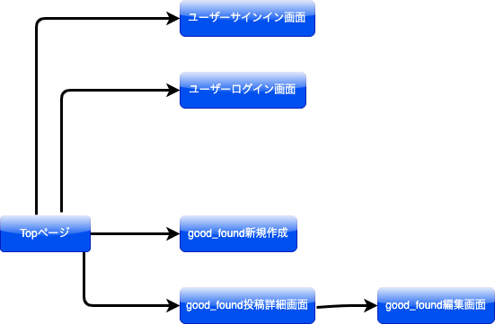

# アプリケーション名  
BRIGHT SIDE

# アプリケーション概要	
起こった出来事のポジティブな面にフォーカスしたSNSアプリです。 
このアプリを使うことで、ユーザーは自分が経験した出来事の良い面に目を向け、ポジティブな気持ちになることができます。 

また、このアプリでは友人と出来事を共有することができます。友人と共有することで、自分の良い面を共有することができるだけでなく、友人からもポジティブなコメントをもらうことができます。さらに、友人が経験した出来事にもコメントすることができ、お互いに励まし合いながら、ポジティブな気持ちを共有することができます。

Bright Sideを使うことで、日々の生活の中で起こる小さなことから大きな出来事まで、ポジティブな視点で見ることができます。そして、ポジティブな気持ちを共有することで、より幸せな生活を送ることができます。

# URL	
https://bright-side.onrender.com/

# テスト用アカウント
Basic認証ID      : ed-host1 
Basic認証パスワード: 2185 
メールアドレス     :user1@test.com 
パスワード        :test123 

# 利用方法

### 良かった出来事の投稿
  1. トップページのヘッダーからユーザー新規登録を行う 
  2. 新規投稿ボタンを押して、良かった出来事の内容（日付、タイトル、詳細、カテゴリ）を入力する	

### 他者の投稿にコメントする
  1. 一覧ページの投稿のタイトルをクリックして、投稿の詳細を確認する 
  2. コメントしたい目標があれば、メッセージを送る

# アプリケーションを作成した背景
現在、私は妻と一緒に、ラインのグループでその日の良い出来事や頑張ったことを共有していました。 
この習慣によって、私たちはお互いのモチベーションを高め、妻の頑張りを理解することができ、会話が活発になっていきました。 
身近な人と良い出来事を共有することは、直接話すことができなくても、ポジティブな気持ちになることができます。
 
しかし、ラインでは共有が難しい場合もあります。そこで私たちは、共有やコメントがより簡単にできるアプリケーションを開発することを考えました。	

# 洗い出した要件	
https://docs.google.com/spreadsheets/d/1yNAZ4UH-IFcBWkelOUe4sQKyG4X16Sfj5OXhHVe8lic/edit?usp=drive_web&ouid=108640310027365961102

# 実装した機能についての画像やGIFおよびその説明
ユーザー作成機能

ログイン機能

良かった出来事の新規投稿機能

良かった出来事の編集機能

良かった出来事の詳細表示機能

良かった出来事へのコメント機能

# 実装予定の機能
現在は、目標を共有する機能を追加実装中 
今後は、コメントの削除機能、BrightPoint機能（出来事の自己採点機能）などを実装予定

# データベース設計	

# 画面遷移図	

# 開発環境	
* HTML/CSS/Ruby/Ruby on Rails/MySQL/Github/Render/Visual Studio Code/Bootstrap

# ローカルでの動作方法
git clone https://github.com/akiyuki-23/bright-side 
% cd アプリケーションのディレクトリ 
% bundle install 
% yarn install 
% rails db:create 
% rails db:migrate 
% rails s 

# 工夫したポイント	
コメント機能はRailのAction Cableを使用し、即時に反映されるようにした。 

削除機能をあえてなくして、別の投稿に変更するよう促した。そのことで、後で投稿した際の気持ちが変わった際も、別の良かったことに上書きができる

初めてのオリジナルアプリの為、コードのテストは出来るだけ実装するように心がけた。